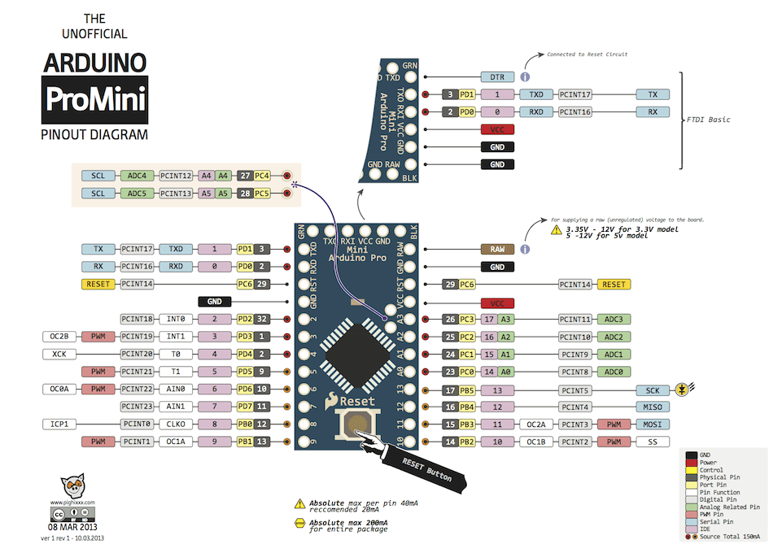
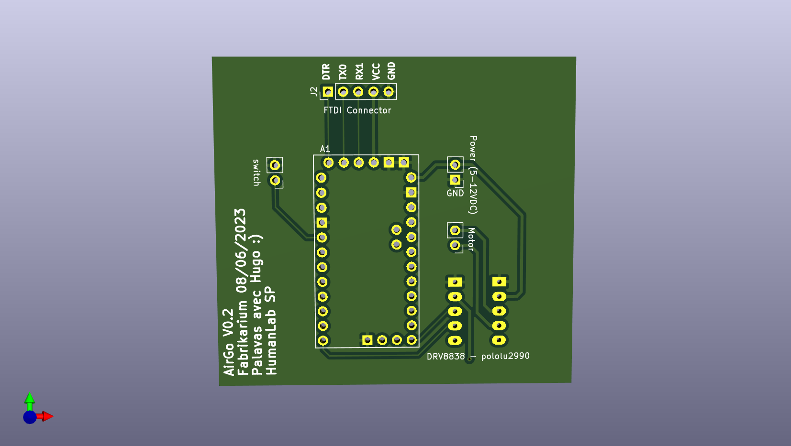

# airgo_firmware
[link to project](https://wikilab.myhumankit.org/index.php?title=Projets:Automatisation_Support_Joystick_Menton_Fauteuil_Roulant)

## Firmware specifications
- smart push button with actions linked to different press types (short press, long press and double press)
- deep sleep, wake on external interrupt of the push button
- drive DC motor CW or CCW depending on state
- (optional) motor current monitoring via shunt resistor and avr ADC

## Hardware
- arduino mini pro 8Mhz
- motor driver DVR8838

