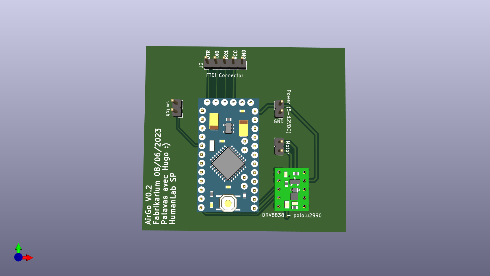

# airgo_firmware
[link to project](https://wikilab.myhumankit.org/index.php?title=Projets:Automatisation_Support_Joystick_Menton_Fauteuil_Roulant)

## Mode of operation
This setup mean to drive a retractable arm that hold a joystick needed to stir an electrical weelchair. The arm can be retracted/extended to its end positions or stopped inbetween. The system is composed of :
- a push button big enough to be actuated with the head. (temporary contact, normally open)
- an arduino mini pro (atmega328p in its 3.3v version preferably)
- a DC motor H-Bridge driver (DVR 8838) to drive the linear actuator that moves the arm
- the linear actuator itself, with en of course switches that autmatically open the power circuit when the it reaches its end of course positions

Once assembled, the system works as described :
- a long press will retract the arm
- a double press will extend the arm
- a simple press will stop the arm

The system works on 7.4 Li-Ion battery, but the arduino mini pro is powered by one cell only on its RAW input, to shunt the voltage regulator. You also have to remove the led on the arduino, so it won't draw current during deep sleep. With this setup, we're able to draw 5 uA in deep sleep mode. As the arduino mini pro doesn't have a usb2serial chip, you will have to [program it with an external programmer](https://www.instructables.com/How-to-Program-Arduino-Pro-Mini-Using-Arduino-UNO/) (arduino as isp, ftdi...).

## Firmware specifications
- smart push button with actions linked to different press types (short press, long press and double press)
- deep sleep, wake on external interrupt of the push button
- drive DC motor CW or CCW depending on state
- (optional) motor current monitoring via shunt resistor and avr ADC

## Hardware
- arduino mini pro 8Mhz
- motor driver DVR8838
- [Schematics here](./doc/schematics.pdf)

